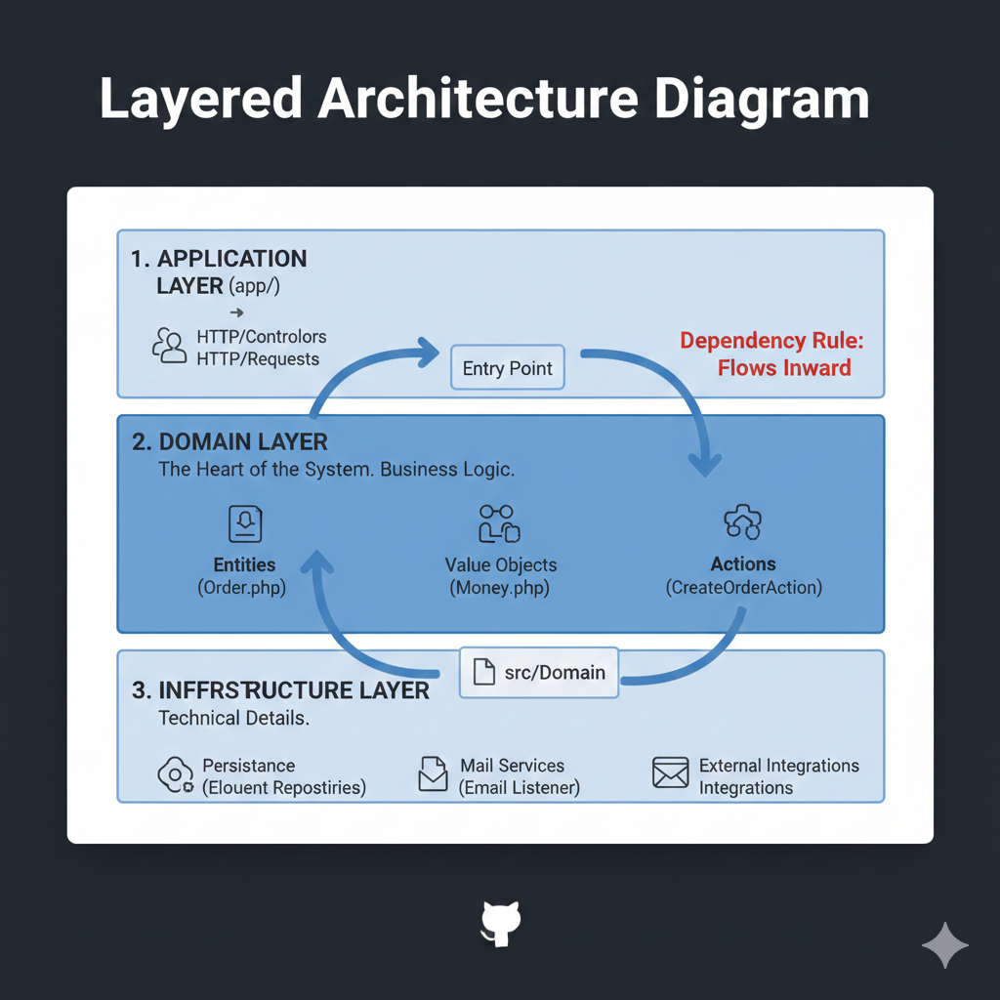

# 🚀 Domain-Oriented Laravel: Elevating MVC to Professional DDD


## 🧠 The Architectural Vision

Software systems are dynamic entities that naturally gravitate toward **entropy**. In standard MVC, as a project scales, controllers become bloated and models turn into "God objects," resulting in a codebase that is difficult to test and maintain.

This project demonstrates a transition from **Technical Partitioning** (organizing by file type) to **Domain Partitioning** (organizing by business function). By treating **Order Management** as a dedicated **Bounded Context**, we isolate core business invariants from the shifting infrastructure.


## 🏗️ Core Pillars of this Architecture

We utilize **Domain-Driven Design (DDD)** principles to ensure high **Cohesion** and low **Coupling**:

### 📐 Layered Architecture Diagram



### 1. The Rich Domain Model (Entities)
Unlike "Anemic Models" that serve as mere data containers, our `Order` entity is a **Rich Domain Model**. It encapsulates behavior and enforces business invariants internally (e.g., automated discount logic).

### 2. Immutability with Value Objects
To prevent floating-point errors, we use the `Money` **Value Object**. It ensures that monetary data is validated upon instantiation and remains immutable, providing a shared **Ubiquitous Language**.

### 3. Hexagonal Thinking (Repository Abstraction)
By defining an `OrderRepositoryInterface` in the Domain layer, we decouple business logic from database technology.


## 📂 Structural Anatomy (PSR-4 Driven)

Custom PSR-4 mapping maintains a clean boundary between layers:

```json
"psr-4": {
    "App\\": "app/",
    "Domain\\": "src/Domain/",
    "Infrastructure\\": "src/Infrastructure/"
}

```

### 🗂 Project Map

```text
src/
├── Domain/
│   └── Order/
│       ├── Actions/             # Business Use Cases (User Stories)
│       ├── DataTransferObjects/ # Type-safe Data Carriers
│       ├── Models/              # Rich Entities (Order.php)
│       ├── Events/              # OrderPlaced.php
│       ├── Repositories/        # Domain Interfaces (Contracts)
│       └── ValueObjects/        # Immutable values (Money.php)
│       └── OrderServiceProvider.php 
├── Infrastructure/
│   └── Order/
│       ├── Repositories/        # Eloquent Implementation
│       └── Listeners/           # Side effects (Email/Notifications)
app/
└── Http/ (Application Layer)
    ├── Controllers/Api/         # Thin Delivery Mechanism
    └── Requests/                # Input Validation

```


## 🛠 Advanced Features

* ✅ **Encapsulated Invariants**: 10% discounts are automatically triggered within the Entity.
* ✅ **Event-Driven Decoupling**: Side effects are handled by async-ready listeners.
* ✅ **Infrastructure Agnosticism**: Swap MySQL for any technology without touching business logic.
* ✅ **PHP 8.4 Excellence**: Full utilization of property promotion and readonly properties.

---

## 🚀 Getting Started

1. **Clone & Install:**
```bash
git clone https://github.com/Eman-Hjazi/laravel-order-management
composer install

```


2. **Setup Environment:**
```bash
cp .env.example .env && php artisan key:generate
php artisan migrate --seed

```


## 📝 Refactor Philosophy & Commit

> *"Software is not about building machines; it's about building models of the world."*

**Phase 2 Refactor Commit:**

```bash
git add .
git commit -m "Architectural Shift: Standard MVC -> Full Domain Isolation. 
- Implemented Rich Entities with encapsulated business rules.
- Added Money Value Object for financial precision.
- Enforced Hexagonal Repository pattern for database agnosticism."

```

---

*This repository is a continuous practice of software mastery.*


